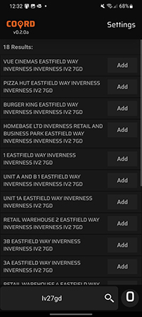
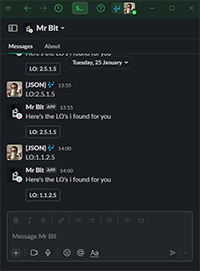
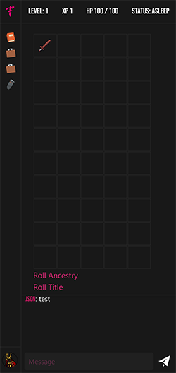
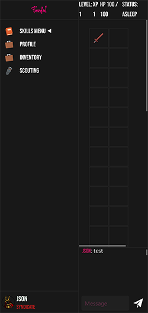
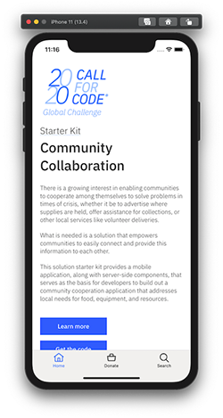
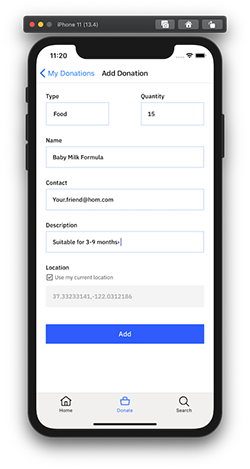
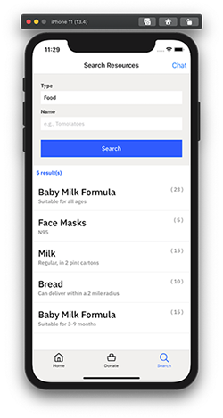
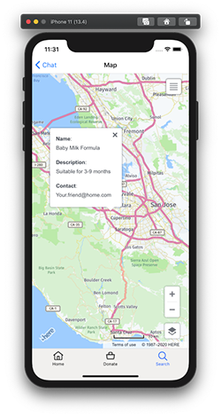
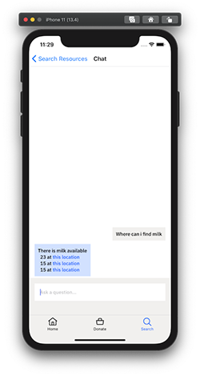

# {JSON}'s Portfolio

## 👋 Who am I?

Hello, my name is Jason or {JSON} as I am more commonly known as, I am a full time student at the University of the Highlands and Islands studying a bachelors in Applied Software Development.
I am currently also a part time Customer Delivery Driver at Tesco and have been with the company for 7 years so far.

In my spare time I also like to play piano and create music, I recently released my first piece of music publicly for Feudal (A game myself and another student are developing) and I am quite pleased with how it turned out.

My main passion in life is definitely programming, I remember writing my first line of code on an Amstrad CPC 464 way back in 1999 when I was just 7, it didn't do much, just a simple ```PRINT "Hello"``` and that fascinated me and is definitely what inspired me to learn more in later years.

## 🧑‍💻 Solo Projects

### [**COORD**](https://beta.coord.uk)

[](https://beta.coord.uk)

Formerly [OSG2C](https://osg2c.uk) is a progressive web app for iOS and Android made specifically for delivery drivers who need to be able to find obscure addresses quickly and easily, written in Typescript and Javascript and deployed using a custom Gitlab CI/CD runner to build a docker image and run in a container on the same server.

I created this app originally to make it easier finding coordinates for specific addresses for myself and my fellow Tesco colleagues as we had to cross reference with certain tools like [One Scotland Gazateer](https://osg.scot) with Google or Apple maps and it was extremely time consuming to do, so I decided to create a tool that will allow us to find them much quicker and provide direct coordinates to every address as they would be added manually by myself and other drivers, it has had great success so far and I would like to continually improve it.

The previous version was written in PHP, HTML and Javascript,using MYSQL as a database, but after all I have learned from the Feudal project, I knew I could greatly improve it.

**Tech Stack:**

* **NodeJS**
* **Docker**
* **MariaDB**
* **Svelte**
* **ExpressJS**
* **SvelteKit**
* **Tailwind CSS**
* **Gitlab CI/CD**

**Screenshots:**  





### [**Mr Bit**](https://gitlab.com/Bowedyapper/mr-bit-slack/)

[](https://gitlab.com/Bowedyapper/mr-bit-slack/)

Mr Bit is a bot for discord and slack that was originally created to increase productivity for students on the Applied Software Development course at UHI by allowing students to quickly find information about the learning outcomes we have to achieve, it was also something I allowed anyone to contribute to so they could generate evidence for reflections towards their learning outcomes.

**Tech Stack:**

* **NodeJS**
* **Docker**
* **Gitlab CI/CD**

**Screenshots:**  




## 👥 Team projects

### [**Feudal**](https://feud.al)

[](https://feud.al)

Feudal is an online browser based MMORPG developed entirely in Javascript / HTML using Sockets for realtime communication, its frontend is built using Svelte and the backend is a dockerised NodeJS Express/SocketIO server with server to server communication via Redis Pub/Sub and load balancing with HAProxy, building it this way will make future migration to a Kubernetes cluster much easier.

It is very much still in the alpha phase as we are still building the base architecture and working out how to tackle game logic, it has allowed me to learn new concepts that I had never previously encountered, such as WebSockets, load balancing, containerisation, clustering, CI/CD(Continuous Integration / Continuous Delivery)

**Tech Stack:**

* **NodeJS**
* **Docker**
* **SocketIO**
* **MongoDB**
* **Redis**
* **HAProxy**
* **Svelte**
* **ExpressJS**
* **SvelteKit**
* **Tailwind CSS**
* **Gitlab CI/CD**

**Screenshots:**  





### **IBM's Call for Code University Spot Challenge - Climate Change**

[](https://callforcode.org/global-challenge/)

Our team came first place in the disaster resiliency category for IBM's 2020 Call for code University spot challenge, we created a prototype app that allowed communities to donate and link to resources that might help people and communities in the event of a disaster. We even employed the use of IBM Watson to create a chat bot that could provide additional support.

[Link to repository](https://github.com/iLewisBrogan/callforcode-uhi)

**Tech Stack:**

* **NodeJS**
* **ExpressJS**
* **Android Studio**
* **JDK(Java Development Kit)**
* **React Native**
* **IBM CoundantDB**
* **IBM Cloud**
* **IBM Watson**
* **HERE Maps**

**Screenshots:** 







## 📃 Education & Certificates


### **University of the Highlands and Islands**  

**Digital Media Basics SCQF Level 4**: 2017 - 2018  
**Computing with Web Design SCQF Level 5**: 2018 - 2019  
**Computing with Cyber Security SCQF Level 6**: 2019 - 2020  
**Applied Software Development BSc(Hons)**: 2020 - Current  


### **IBM**  

[Open Source Foundations](https://www.credly.com/badges/c459e015-c678-4e63-9d9a-1285c64efdf5?source=linked_in_profile) -  Feb 2022  
[Enterprise Design Thinking Practitioner](https://www.youracclaim.com/badges/c459e015-c678-4e63-9d9a-1285c64efdf5?source=linked_in_profile) - Nov 2020

## 🙋‍♂️ Social Links

**LinkedIn**: https://www.linkedin.com/in/yaml-alternative/  
**Twitter**: https://twitter.com/BowedYapper  
**HyperFollow**: https://hyperfollow.com/JasonHewitt